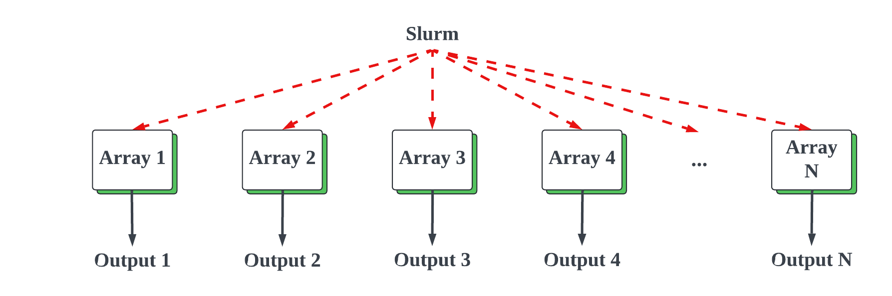

# ACCRE Tutorial

A short tutorial on using [ACCRE](https://www.vanderbilt.edu/accre/) aimed at Biostatistician needs. 

[Vanderbilt University Medical Center](https://www.vumc.org/main/home)
[Department of Biostatistics](https://www.vumc.org/biostatistics/vanderbilt-department-biostatistics)

A short intro to [ACCRE](https://jeffreyliang-vandy.github.io/ACCRE/accre_introduction.html)
is provided by Jeffrey Liang. This is designed to be a useable template and
example of a recommended solution design using R. It is executable and
modifiable, with clear instructions on what modifications should be made. 
Please fork this repository and use as a seed for your own ACCRE simulation 
project. Two key goals: reproducibility and simplicity. 

## Parallel Versus Array

Parallel computing is required to numerically evaluate large simulations 
involving spatial and time information. The [Parallel Pipeline Computation Model](http://users.ece.northwestern.edu/~wkliao/STAP/model.html) at
Northwestern demonstrates this numerical analytic design. 


These kinds of problems are common in solving large partial differential
equations, ultra high dimensional spectral analysis, and nuclear simulations.
ACCRE provides resources for solving such problems, and it involves having a
high number of CPUs and nodes with high speed communication buses allocated
all at once. A problem of this type quickly burns through fair share and can
leave ones smaller shared group account depleted with just a couple requests.
It also leads to long delays in a job getting executed.
The proper configuration and solution design of such problems is complex and 
requires dedicated study. 



Biostatistics problems typically consist of simulations involving multiple
runs that are independent and do not communicate or share information with
other runs. These types of problems are known as batch array jobs. Note the
lack of coordination or communication between the nodes. The
relevant [slurm](https://slurm.schedmd.com/overview.html) parameter is `array`. 
This runs multiple jobs independently and fits them in as possible, likely 
using less resources than a parallel job request.

*Important:* A batch array should slurm look something like this:

```
...
#SBATCH --nodes=1
#SBATCH --ntasks=1
#SBATCH --cpus-per-task=1
#SBATCH --array=1-250
...
```

The advice going around that _'the more nodes the faster the job'_ is *not* true. In fact it's the opposite. This snippet says we don't need complex coordination across nodes and tasks with multiple cpus running for a task. We just need 1 job run 250 times. In 
other words each independent simulation needs a single node for a
single task with a single CPU. 
It requests this configuration 250 times independently, and doesn't ask for
any special parallel needs.

With a large parallel setup, ACCRE has to plan and wait for all those resources to be available at once. With independent batch arrays it can fit in the cracks between all the other jobs running. Array jobs will get queued 
faster and turn around will generally be quicker, and depending on fair
share weighting takes fewer resources from the group pool than a 
parallel request.

One could submit more batches later and give them a different range of numbers.

```
...
#SBATCH --array=251-500
...
```

When slurm executes the job, this array number is important. It can control the associated design from a data.frame, it can seed the random number generator for repeatability. It can be used to identify failures. 
Understanding the propagation of the array batch number from the slurm
file through the R and how it's used is a key concept of this tutorial.

## Goals

What is required is some _simple_ scripts that allow one to quickly identify
a failed job and to reproduce that behavior locally. For example, batch
array number 123 might fail, and in a local development environment one
would wish to reproduce that exact failure to determine what set of 
conditions led to that failure. These scripts should also require
no modification running locally or on ACCRE.

## Walkthrough Example

### Required Training

Make sure one has taken the [required training courses](https://www.vanderbilt.edu/accre/getting-started/training/)
for using ACCRE. If one has not done this and opens a support
request or consumes too many resources, access may be denied. This
will also help get your account setup.

One also needs to understand the [command line](https://ubuntu.com/tutorials/command-line-for-beginners#1-overview)
using a terminal or shell. Various [references](https://www.geeksforgeeks.org/linux-commands-cheat-sheet/) exist
on the web of the most common commands. 

### Determine Job Resources

This is a tricky bit. Two pieces of unknown information are required. Time to 
execute and memory used. 

```
> source('simulation.R')
> system.time(simulation(1))
   user  system elapsed 
  0.021   0.000   0.020 
> sum(.Internal(gc(FALSE, FALSE, TRUE))[13:14])
[1] 44.3
```

Running the job locally and tracking simulation time and total memory used
tells us that we need 0.02 seconds of time and 44.3 MB. These are then
used to inform the slurm requirements. In general modern laptops are
more powerful that the nodes on ACCRE, but with ACCRE you get
access to 1000's. Modify your slurm jobs parameters to be twice the 
time and about 50% or more of the memory required for some margin of
safety. 

If one overspecifies, it penalizes placement in the queue. If one 
underspecifies the job is terminated before completion. 

In the example case, we went a bit over this as these values are
quite low. 

```
#SBATCH --time=00:01:00
#SBATCH --mem=100M
```

This asks for a 1 minute of time with 100M available. 

### Array Job Output

The slurm line

```
#SBATCH --output=status/job%a.out
```

Tells ACCRE that all output from `cat`, `message`, `print`, and `stop` be
written into the directory status, and give a title like `job12.out` via substitution of the array number. There is a lot of freedom in naming,
See [filename pattern](https://slurm.schedmd.com/sbatch.html) in slurm
help files. Most the other possible information is great for tracking a 
running job, but not very helpful for reproducibilty of results. The
array number allows to identify what succeeded and what failed from our
requested jobs. 

### File Descriptions

design.R
: This contains or creates a data.frame `simulation_design` that provides parameters associated with the array number. This should be heavily modified by the end user for their target problem.

sim-accre.R
: This requires no modification and takes the ARRAY number from the command line when executed and sets the random seed and calls `simulation(x)` where `x` is the array number.

sim-local.R
: This is for local testing using multiple cores. Generally good for trying a few array batches to make sure the code is ready for ACCRE. It has a couple modification points for your local configuration or array goals.


simulation.R
: This is the R code that demonstrates a simulation, that pulls the design, provides that to a function and saves the output. It is a template that requires modification for your project and research. It should remain about as simple as it is now, and complex simulation code should be sourced into it. It has a cohesive clear purpose and outline. Putting a lot of simulation custom code here would reduce the cohesion. 

simulation.slurm
: An example slurm file that runs this example simulation, "add it up". 

## Array ID Information Flow

The Array Task ID propagates through the code in the following manner:

```
Slurm (${SLURM_ARRAY_TASK_ID}) -> 
sim-accre.R (command line) -> 
set.seed(array_task_id) -> 
simulation(array_task_id) -> 
simulation_design[array_task_id,] ->
save( part of output file name )
```

The setting of the random seed allows one to reproduce any given 
job run in another setting. Thus a failed job, one can debug locally.

### Working Example

```
vunetid:~$ ssh vunetid@login.accre.vanderbilt.edu
vunetid@login.accre.vanderbilt.edu's password: *****
Last login: Thu Sep  1 13:50:59 2022 from 10.151.20.117
Vanderbilt University - Advanced Computing Center for Research and Education

    _    ____ ____ ____  _____    ____ _           _
   / \  / ___/ ___|  _ \| ____|  / ___| |_   _ ___| |_ ___ _ __
  / _ \| |  | |   | |_) |  _|   | |   | | | | / __| __/ _ \ |__|
 / ___ \ |__| |___|  _ <| |___  | |___| | |_| \__ \ ||  __/ |
/_/   \_\____\____|_| \_\_____|  \____|_|\__,_|___/\__\___|_|

===============================================================

Go forth and compute!

This is a shared gateway node designed for interactive use and small test jobs.
Please restrict your total system memory usage to less than 31 GB,
and do not run individual processes exceeding 20 minutes of CPU-time.

To list useful cluster commands type:      accre_help
To view your current storage type:         accre_storage
To list basic Linux commands type:         commands101
```
Once logged in it's good (but not required) to set up a ssh key with
github to allowed easy editing from ACCRE. See [github docs](https://docs.github.com/en/authentication/connecting-to-github-with-ssh/generating-a-new-ssh-key-and-adding-it-to-the-ssh-agent). 

```
[vunetid@gw346 ~]$ ssh-keygen -t ed25519 -C "your_email@example.com"
Generating public/private ed25519 key pair.
Enter file in which to save the key (/home/vunetid/.ssh/id_ed25519): 
Enter passphrase (empty for no passphrase): 
Enter same passphrase again: 
Your identification has been saved in /home/vunetid/.ssh/id_ed25519.
Your public key has been saved in /home/vunetid/.ssh/id_ed25519.pub.
The key fingerprint is:
SHA256:QfgECwi18rmohyLD/8lJ/ASDFASDFOvP7Ajof/g your_email@example.com
The key's randomart image is:
+--[ED25519 256]--+
|.oo.. .o.        |
|. o   .o.o       |
|  .. ..o.        |
| o .  o =..      |
| ...o + + +      |
|  o  o +S=       |
|oo...= . =       |
|B...=.O .        |
|++oo+EoB         |
+----[SHA256]-----+
[vunetid@gw346 ~]$ cat ~/.ssh/
id_ed25519      id_ed25519.pub  known_hosts     
[vunetid@gw346 ~]$ cat ~/.ssh/id_ed25519.pub
ssh-ed25519 AAAAC3ASDFASDFASDFASDFASDFASDFASDFsXRQwPG2kQLdeV your_email@example.com
```

Copy the resulting _*public*_ key `id_ed25519.pub` to your github account. The associated 
`id_ed25519` is the private key that is equivalent to a password and
should be treated with great care.


```
[vunetid@gw346 ~]$ git clone git@github.com:vubiostat/accre_tutorial.git
Cloning into 'accre_tutorial'...
Warning: Permanently added the ECDSA host key for IP address '140.82.112.3' to the list of known hosts.
remote: Enumerating objects: 29, done.
remote: Counting objects: 100% (29/29), done.
remote: Compressing objects: 100% (20/20), done.
remote: Total 29 (delta 12), reused 23 (delta 9), pack-reused 0
Receiving objects: 100% (29/29), 7.39 KiB | 0 bytes/s, done.
Resolving deltas: 100% (12/12), done.
[vunetid@gw346 ~]$ cd accre_tutorial
```

This has cloned the project and pulled the source in from github to
the local ACCRE gateway. If one
uses github, coordinating source code between a local device and accre is
relatively easy. One could edit code on ACCRE, commit to get and push centrally.
Then pull locally. As well as edit locally and pull modified code onto ACCRE.
The purpose of git is to keep all copies and edits of source code and
synchronize them between devices. Note, the clone would need to use 
the ssh link for the project and keys from ACCRE loaded to github.

```
[vunetid@gw346 accre_tutorial]$ git pull
Already up-to-date.
```

Now one can submit this example job for execution using [slurm commands](https://hpc.nmsu.edu/discovery/slurm/commands/) and
check on it's status. It's design to use few resources so feel
free to give it a try.

```
[vunetid@gw346 accre_tutorial]$ sbatch simulation.slurm 
Submitted batch job 61567954
[vunetid@gw346 accre_tutorial]$ squeue -u vunetid
             JOBID PARTITION     NAME     USER ST       TIME  NODES NODELIST(REASON)
       61567954_10 productio simulati vunetid CG       0:05      1 cn1345
        61567954_1 productio simulati vunetid  R       0:05      1 cn1275
        61567954_2 productio simulati vunetid  R       0:05      1 cn1284
        61567954_3 productio simulati vunetid  R       0:05      1 cn1348
        61567954_4 productio simulati vunetid  R       0:05      1 cn1352
        61567954_5 productio simulati vunetid  R       0:05      1 cn1369
        61567954_8 productio simulati vunetid  R       0:05      1 cn1333
        61567954_9 productio simulati vunetid  R       0:05      1 cn1333
       61567954_11 productio simulati vunetid  R       0:05      1 cn1345
       61567954_12 productio simulati vunetid  R       0:05      1 cn1367
       61567954_13 productio simulati vunetid  R       0:05      1 cn1367
       61567954_14 productio simulati vunetid  R       0:05      1 cn1399
       61567954_15 productio simulati vunetid  R       0:05      1 cn1399
       61567954_16 productio simulati vunetid  R       0:05      1 cn1307
       61567954_17 productio simulati vunetid  R       0:05      1 cn1308
       61567954_18 productio simulati vunetid  R       0:05      1 cn1308
```

After waiting a few minutes, most of the jobs will be done. 

```
[vunetid@gw346 accre_tutorial]$ squeue -u vunetid
             JOBID PARTITION     NAME     USER ST       TIME  NODES NODELIST(REASON)
```

Now we can check to see how successful this was. 

```
[vunetid@gw346 accre_tutorial]$ cd status
[vunetid@gw346 status]$ grep -i error *
job12.out:Error in simulation(x) : SOMETHING WENT HORRIBLY WRONG!
[vunetid@gw346 status]$ less job12.out # examines full log
```

Sure enough one of the jobs contained an error. Let's run that locally and
see if we can recreate it. Jumping back to a local terminal.

```
[vunetid@gw346 status]$ exit
logout
Connection to login.accre.vanderbilt.edu closed.
vunetid:~/Projects/accre_tutorial$
```

Then editing sim-local.R, this line:

```
mclapply(12:13,         # <=== MODIFY HERE Batch Array numbers to run locally
         mc.cores=8,
```

This says we will rerun 12 and 13 locally. But this is for doing multiple batches. A better direct debug session would be as follows:

```
vunetid:~/Projects/accre_tutorial$ R

R version 4.3.3 (2024-02-29) -- "Angel Food Cake"
Copyright (C) 2024 The R Foundation for Statistical Computing
Platform: x86_64-pc-linux-gnu (64-bit)

R is free software and comes with ABSOLUTELY NO WARRANTY.
You are welcome to redistribute it under certain conditions.
Type 'license()' or 'licence()' for distribution details.

  Natural language support but running in an English locale

R is a collaborative project with many contributors.
Type 'contributors()' for more information and
'citation()' on how to cite R or R packages in publications.

Type 'demo()' for some demos, 'help()' for on-line help, or
'help.start()' for an HTML browser interface to help.
Type 'q()' to quit R.

> source('simulation.R')
> set.seed(12)
> simulation(12)
Error in simulation(12) : SOMETHING WENT HORRIBLY WRONG!
```

Locally we've reproduced the failure and can move towards getting that
fixed. After some work, the problem is found in `simulation.R` on this
line:

```
  if(array_task_id == 12) stop("SOMETHING WENT HORRIBLY WRONG!")
```

If one deletes that line, locally commits and saves to git. One can jump back
over to ACCRE and do a git pull in the project and the changes will be
ready to rerun job 12. 

We just need to edit the `simulation.slurm` and change the request batch to rerun the fixed job. 

```
...
#SBATCH --array=12
...
```

Now when we submit this slurm job it will only run the single job that has
task array id 12. 

```
[vunetid@gw344 accre_tutorial]$ sbatch simulation.slurm

... Wait and check for job to complete and check for errors

[vunetid@gw344 accre_tutorial]$ grep -i error status/*

```

With that clean bill of health, let's pull the data locally for analysis. The
`scp` command stands for 'secure copy' and can move files between environments.
Be sure to always include a ':' in a url of a remote device, otherwise it 
will just work locally and lead to confusion. 

```
vunetid:~/Projects/accre_tutorial$ scp -r login.accre.vanderbilt.edu:accre_tutorial/output .
vunetid@login.accre.vanderbilt.edu's password: 
result-0001.Rdata                             100%   85     2.7KB/s   00:00    
result-0002.Rdata                             100%   85     2.9KB/s   00:00    
result-0004.Rdata                             100%   85     2.8KB/s   00:00    
result-0003.Rdata                             100%   85     2.7KB/s   00:00    
result-0015.Rdata                             100%   86     2.9KB/s   00:00    
result-0014.Rdata                             100%   86     1.8KB/s   00:00    
result-0016.Rdata                             100%   86     2.9KB/s   00:00    
result-0017.Rdata                             100%   86     2.8KB/s   00:00    
result-0007.Rdata                             100%   85     2.3KB/s   00:00    
result-0008.Rdata                             100%   85     2.9KB/s   00:00    
result-0018.Rdata                             100%   86     2.7KB/s   00:00    
result-0006.Rdata                             100%   85     3.0KB/s   00:00    
result-0005.Rdata                             100%   85     2.8KB/s   00:00    
result-0010.Rdata                             100%   86     2.9KB/s   00:00    
result-0009.Rdata                             100%   85     2.7KB/s   00:00    
result-0013.Rdata                             100%   86     2.8KB/s   00:00    
result-0011.Rdata                             100%   86     2.7KB/s   00:00    
result-0019.Rdata                             100%   86     2.9KB/s   00:00    
result-0020.Rdata                             100%   86     2.6KB/s   00:00    
result-0012.Rdata                             100%  132     3.4KB/s   00:00     
vunetid:~/Projects/accre_tutorial$ ls output
result-0001.Rdata  result-0006.Rdata  result-0011.Rdata  result-0016.Rdata
result-0002.Rdata  result-0007.Rdata  result-0012.Rdata  result-0017.Rdata
result-0003.Rdata  result-0008.Rdata  result-0013.Rdata  result-0018.Rdata
result-0004.Rdata  result-0009.Rdata  result-0014.Rdata  result-0019.Rdata
result-0005.Rdata  result-0010.Rdata  result-0015.Rdata  result-0020.Rdata
```

Let's aggregate results for reporting now that they are pulled local.

```
> results <- do.call(rbind, lapply(list.files('output'), function(x) {
  load(file.path('output',x))
  n <- nchar(x)
  result <- as.data.frame(result)
  result$batch <- as.numeric(substr(x, n-9, n-6))
  result
}))
> results
   result batch
1       3     1
2       4     2
3       5     3
4       6     4
5       7     5
6       4     6
7       5     7
8       6     8
9       7     9
10      8    10
11      4    11
12      5    12
13      6    13
14      7    14
15      8    15
16      5    16
17      6    17
18      7    18
19      8    19
20      9    20
```

There it is, the results of our batch runs. One can now proceed to produce 
spectacular reports of the findings. This ends the main tutorial of running
jobs on ACCRE for Biostatistics.

## Installing Packages

Installing packages in the ACCRE environment can be challenging.

### Minor Housekeeping

The following if placed in `~/.Rprofile` will set quit to always not save the 
environment and set the CRAN mirror to nearby Oak Ridge. 

```
utils::assignInNamespace(
  "q",
  function(save="no", status=0, runLast=TRUE)
  {
    .Internal(quit(save, status, runLast))
  },
  "base"
)
options(repos=c(CRAN="https://mirrors.nics.utk.edu/cran/"))

```

### Load Modules

One can now proceed to install R packages from source by loading the latest
R modules into the environment.

```
module purge
module load GCC/11.3.0
module load OpenMPI/4.1.4
module load R/4.2.1
```

With R loaded one can proceed to install packages. Chose local library when
asked. 

```
[vunetid@gw344 accre_tutorial]$ R

R version 4.2.1 (2022-06-23) -- "Funny-Looking Kid"
Copyright (C) 2022 The R Foundation for Statistical Computing
Platform: x86_64-pc-linux-gnu (64-bit)

R is free software and comes with ABSOLUTELY NO WARRANTY.
You are welcome to redistribute it under certain conditions.
Type 'license()' or 'licence()' for distribution details.

  Natural language support but running in an English locale

R is a collaborative project with many contributors.
Type 'contributors()' for more information and
'citation()' on how to cite R or R packages in publications.

Type 'demo()' for some demos, 'help()' for on-line help, or
'help.start()' for an HTML browser interface to help.
Type 'q()' to quit R.
> install.packages('cli')
Warning in install.packages("cli") :
  'lib = "/cvmfs/oasis.opensciencegrid.org/accre/mirror/optimized/sandy_bridge/easybuild/software/MPI/GCC/11.3.0/OpenMPI/4.1.4/R/4.2.1/lib64/R/library"' is not writable
Would you like to use a personal library instead? (yes/No/cancel) yes
Would you like to create a personal library
‘/panfs/accrepfs.vampire/home/vunetid/R/x86_64-pc-linux-gnu-library/4.2’
to install packages into? (yes/No/cancel) yes
trying URL 'https://mirrors.nics.utk.edu/cran/src/contrib/cli_3.6.2.tar.gz'
Content type 'application/x-gzip' length 569771 bytes (556 KB)
==================================================
downloaded 556 KB

* installing *source* package ‘cli’ ...

...

installing to /panfs/accrepfs.vampire/home/vunetid/R/x86_64-pc-linux-gnu-library/4.2/00LOCK-cli/00new/cli/libs
** R
** exec
** inst
** byte-compile and prepare package for lazy loading
** help
*** installing help indices
*** copying figures
** building package indices
** testing if installed package can be loaded from temporary location
** checking absolute paths in shared objects and dynamic libraries
** testing if installed package can be loaded from final location
** testing if installed package keeps a record of temporary installation path
* DONE (cli)

The downloaded source packages are in
	‘/tmp/RtmpeV14yC/downloaded_packages’
> 
```

## Docker

The R versions hosted by ACCRE are usually out of date, as the speed of
R versions changes rapidly. This can cause issues with getting
all the packages installed, since CRAN has no support for older
versions of R or the packages compiled for them. The recommended
solution is [Docker](https://en.wikipedia.org/wiki/Docker_(software)). 
It allows one to create a binary bundle that contains all the installed packages
required and is a lightweight virtual computer. Let's explore the
steps required to create a docker image of our Add It Up example. 

Jeffrey has a [tutorial](https://jeffreyliang-vandy.github.io/ACCRE/accre_introduction.html#/docker) 
on building a Docker image using [Singularity](https://en.wikipedia.org/wiki/Singularity_(software)),
which is the version of Docker supported by ACCRE. 
